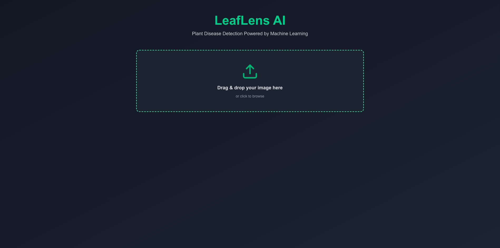
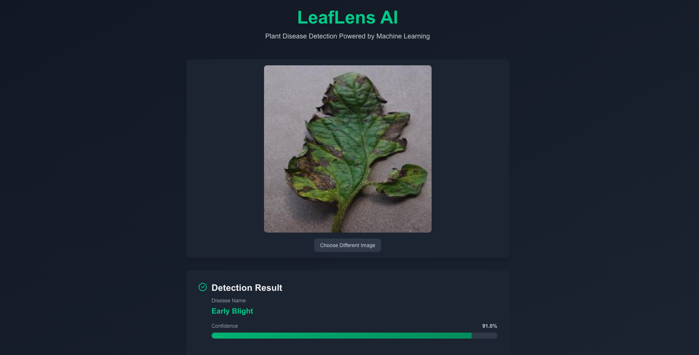

# LeafLens AI 🌿

_A Universal Plant Disease Detection System powered by Deep Learning (MobileNetV2)._

[](https://www.python.org/)
[](https://www.tensorflow.org/)
[](https://fastapi.tiangolo.com/)
[](https://nextjs.org/)
[](https://www.docker.com/)
[](https://tailwindcss.com/)

---

## 📖 About the Project

**LeafLens AI** is an end-to-end machine learning solution that detects plant diseases across multiple species using a single, universal deep learning model. Built with a modern tech stack, this project demonstrates a complete ML pipeline from data preparation and model training to deployment as a production-ready web application.

### 🌟 Key Highlights

- **Universal Model Architecture**: A single MobileNetV2-based model capable of detecting diseases across **multiple plant species** (Apple, Cherry, Corn, Grape, Peach, Pepper, Potato, Tomato, and more), eliminating the need for species-specific models.

- **Confidence Threshold Safety**: Implements a smart confidence threshold (70% default) that filters out non-plant images and low-confidence predictions, addressing the "Open World" problem in production ML systems.

- **Dynamic Model Loading**: The backend dynamically loads model files and class names from JSON configuration, making it easy to update models without code changes.

---

## ✨ Key Features

- 🐳 **Dockerized**: One command to run the entire stack (backend + frontend)
- ⚡ **Real-time Inference**: Fast predictions using optimized MobileNetV2 architecture
- 🎨 **Modern UI**: Beautiful drag-and-drop interface with instant feedback and dark mode support
- 🧠 **Smart Processing**: Backend dynamically loads models and class names from JSON
- 🔒 **Production-Ready**: Comprehensive error handling, logging, and health checks
- 📊 **RESTful API**: Well-documented FastAPI with automatic OpenAPI/Swagger documentation

---

## 🚀 How to Run

### Prerequisites

- [Docker](https://www.docker.com/get-started) and [Docker Compose](https://docs.docker.com/compose/install/) installed
- (Optional) Python 3.13+ and Node.js 18+ for local development

### Quick Start with Docker (Recommended)

1. **Clone the repository**

   ```bash
   git clone https://github.com/cauegrassi7/leaflens-ai.git
   cd leaflens-ai
   ```

2. **Start the application**

   ```bash
   docker-compose up --build
   ```

3. **Access the application**
   - **Frontend**: [http://localhost:3000](http://localhost:3000)
   - **API Documentation**: [http://localhost:8000/docs](http://localhost:8000/docs)
   - **API Health Check**: [http://localhost:8000/health](http://localhost:8000/health)

The Docker setup automatically:

- Builds both backend and frontend containers
- Mounts the ML models directory for the backend
- Sets up proper networking between services
- Includes health checks and auto-restart policies

### Local Development (Alternative)

#### Backend Setup

```bash
# Create and activate virtual environment
python3 -m venv venv
source venv/bin/activate  # On Windows: venv\Scripts\activate

# Install dependencies
pip install -r requirements.txt

# Run the backend server
uvicorn backend.app.main:app --reload --host 0.0.0.0 --port 8000
```

#### Frontend Setup

```bash
cd frontend

# Install dependencies
npm install

# Run development server
npm run dev
```

---

## 📁 Project Structure

```
leaflens-ai/
├── backend/                 # FastAPI backend application
│   ├── app/
│   │   ├── api/            # API route handlers
│   │   ├── core/           # Configuration and settings
│   │   ├── schemas/        # Pydantic response models
│   │   ├── services/       # Business logic layer
│   │   └── main.py         # FastAPI application entry point
│   ├── Dockerfile          # Backend container definition
│   └── run.py              # Backend startup script
│
├── frontend/               # Next.js frontend application
│   ├── src/
│   │   └── app/            # Next.js app directory
│   │       ├── page.tsx    # Main application page
│   │       └── layout.tsx  # Root layout component
│   ├── Dockerfile          # Frontend container definition
│   └── package.json        # Node.js dependencies
│
├── ml/                     # Machine learning pipeline
│   ├── data/               # Training and validation datasets
│   │   └── raw/
│   │       ├── train/      # Training images (organized by class)
│   │       └── val/        # Validation images (organized by class)
│   ├── models/             # Trained model files
│   │   ├── plant_disease_model_vuniversal_v1.keras
│   │   └── classes_vuniversal_v1.json
│   ├── notebooks/          # Jupyter notebooks for exploration
│   │   ├── 1_data_exploration.ipynb
│   │   └── 2_model_training.ipynb
│   └── scripts/
│       └── train.py        # Model training script
│
├── docker-compose.yml      # Docker Compose configuration
├── requirements.txt        # Python dependencies
└── README.md              # This file
```

### Directory Purpose

- **`ml/`**: Contains the complete ML pipeline including data preprocessing, model training scripts, and trained model artifacts. The training pipeline uses TensorFlow/Keras to build a MobileNetV2-based classifier.
- **`backend/`**: FastAPI REST API that serves model predictions. Handles image preprocessing, model inference, and response formatting with proper error handling.
- **`frontend/`**: Next.js 16 application with TypeScript and Tailwind CSS. Provides an intuitive drag-and-drop interface for uploading plant images and displaying prediction results.

---

## 📸 Screenshots

### Home Screen
The intuitive drag-and-drop interface makes it easy to upload plant images for analysis.



### Prediction Result
Real-time disease detection with confidence scores and detailed information.



---

## 🔌 API Endpoints

### `GET /`

Root endpoint providing API metadata, version information, and available endpoints.

### `GET /health`

Health check endpoint. Returns system status and model loading state.

**Response:**

```json
{
  "status": "healthy",
  "classes_count": 38
}
```

### `POST /predict`

Upload an image file to get a plant disease prediction.

**Request:** `multipart/form-data` with `file` field containing an image

**Response (High Confidence):**

```json
{
  "class_name": "Tomato___Bacterial_spot",
  "confidence": 0.95
}
```

**Response (Low Confidence):**

```json
{
  "class_name": "Unidentified",
  "confidence": 0.45,
  "low_confidence": true,
  "message": "Model confidence (45%) was too low. The image may not be of a known plant."
}
```

### `GET /docs`

Interactive API documentation (Swagger UI)

### `GET /redoc`

Alternative API documentation (ReDoc)

---

## 🛠️ Technology Stack

### Backend

- **FastAPI**: Modern, fast web framework for building APIs
- **TensorFlow/Keras**: Deep learning framework for model inference
- **Pillow**: Image processing library
- **Uvicorn**: ASGI server for FastAPI

### Frontend

- **Next.js 16**: React framework with App Router
- **TypeScript**: Type-safe JavaScript
- **Tailwind CSS 4**: Utility-first CSS framework
- **Axios**: HTTP client for API requests
- **Lucide React**: Modern icon library

### Machine Learning

- **TensorFlow 2.18**: Deep learning framework
- **Keras 3.3+**: High-level neural networks API
- **MobileNetV2**: Efficient CNN architecture for mobile/edge devices
- **NumPy**: Numerical computing
- **Pandas**: Data manipulation and analysis

### DevOps

- **Docker**: Containerization
- **Docker Compose**: Multi-container orchestration

---

## 📝 License

This project is licensed under the terms specified in the [LICENSE](LICENSE) file.

---

## 🤝 Contributing

Contributions are welcome! Please feel free to submit a Pull Request.

---

## 📧 Contact

For questions or inquiries, please open an issue on GitHub.

---

**Built with ❤️ using Python, TensorFlow, FastAPI, and Next.js**
